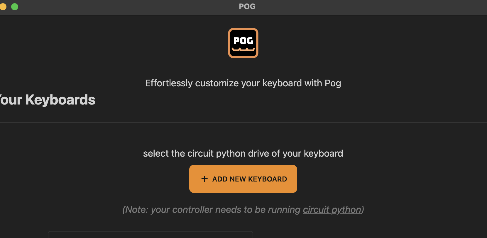

# Setup a new keyboard

## Step 0 - Circuit Python
You only need a keyboard with a controller that is circuit python compatible (eg. any rp2040 chip like the pi pico 
or [helios](https://keeb.supply/products/0xcb-helios))

First download circuit python for you controller if you haven't already set it up.

https://circuitpython.org/downloads take care to download the correct file that matches your controller from that list 
and move it to the drive that appears when you plug in your keyboard. if that drive is named circuit python it is likely 
already setup

now open pog and click the `add new keyboard` button on the main screen.
here you will select the drive of you keyboard eg. the circuit python usb drive.

:::tip testing 
for testing you can also just select any folder on your computer and look at the files that pog generates to see what will happen.
you can then move those files to your circuit python drive.
:::

## Step 1 installing kmk
pog will check your drive for an existing kmk installation, you can click `install kmk` to have pog automatically 
download and install kmk.

if you want to do this manually you can press `skip`, then you would need to download kmk form their 
[github](https://github.com/KMKfw/kmk_firmware) and move just the `kmk` folder that is inside of the `kmk-master` 
folder on to the root of your circuit python drive

:::tip feature missing
the copy process can take quite a while (5min) and the progress indicator is currently not fully working so check 
the folder contents if you want to unplug the drive in a hurry
:::

## Step 2 Name your keyboard
For managing multiple keyboards it is recommended to give your keyboard a name, if you in the future want to publish 
your config file please use the keyboard name and manufacturer. you can also set a description and custom tags.
all these fields are optional but you will need to identify your keyboard by its path in the filesystem if you dont set a name.

## Step 3 Wiring Definitions - Matrix
now choose between matrix wiring and direct pin wiring. matrix wiring usually includes diodes to prevent ghosting and 
allows more keys on the same amount of data pins. 

also define the size of the matrix or the amount of pins for direct wiring here and if your board is a split keyboard.
you can find these values in the qmk source files if they exist and just count the col_pins and row_pins for width and height.

## Step 4 Wiring Definitions - Pins
now if you chose the matrix wiring set the directions of the diodes here. either they face from columns to rows or the other way around.

then set the pin number for each data pin. on the right you will see links to pinouts for controllers to look up the pin numbers.
by default the pin prefix is set to prepend `board.GP` to every number you enter, this works well for chips like the helios
or the pi pico. if your microcontroller uses other pin namings switch the prefix there.

if you dont have a keyboard layout editor file for the board or are not importing the config of someone else, the order of 
the pins is irrelevant as we will build a coord_mapping in the next step. just make sure the pins are assigned to the correct 
type like row or column.

## Step 5 Coord_Mapping
coord mapping is a kmk feature assign physical switches to the correct positions on the keymap.
when you have setup the pins correctly for all the wiring you can press the `flash coordmap finder` button to put a firmware
on your keyboard that outputs the index of the currently pressed key.

then you can focus the textarea by clicking it and start pressing all keys on your keyboard row by row starting from the top left.
each key that you press will be shown below in an automatically created keyboard layout. 
when you encounter blank spaces in you layout you can add these with the `add space` button.
when you reached the end of a row you can either press the last key in that row twice or press the `new row` button.
when you are done press the `next` button

## Step 6 Layout
here you can modify the keyboard layout visually see (LayoutEditor)[./features/layouteditor.md] for details
you can change all values of the setup later if you feel like it.
click `finish setup` when you are done 

## Step 7 Keymap
now you can use the keymap editor to adjust your keymap select a key on the keyboard and then click any key on the key picker below.
you can also select multiple keys at once or even adjust the specific keycodes in the input field below 